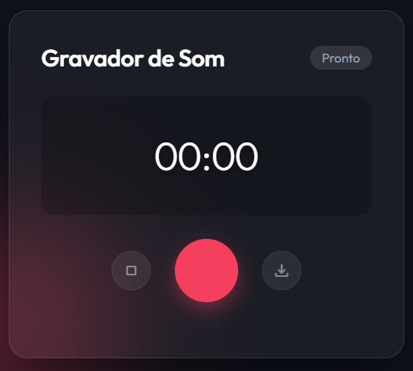

# 🎙️ Gravador de Áudio Premium

Um aplicativo web moderno e elegante para gravação de áudio, apresentando uma interface com design **Glassmorphism**, visualizador de áudio em tempo real e animações fluidas.



## ✨ Funcionalidades

- **Design Premium**: Interface escura com efeitos de vidro (Glassmorphism) e background animado.
- **Visualizador em Tempo Real**: Barras de frequência que reagem à sua voz enquanto você grava.
- **Controles Intuitivos**:
  - Iniciar/Parar gravação.
  - Playlist automática das gravações recentes.
  - Player de áudio integrado para ouvir antes de baixar.
- **Download Fácil**: Baixe suas gravações no formato `.webm` instantaneamente.
- **Atalhos de Teclado**:
  - `Espaço` ou `R`: Iniciar Gravação
  - `Esc` ou `S`: Parar Gravação

## 🛠️ Tecnologias Utilizadas

- **HTML5**: Estrutura semântica.
- **CSS3 (Vanilla)**:
  - Variáveis CSS para temas.
  - Flexbox e Grid para layout.
  - Animações `@keyframes`.
  - Backdrop-filter para o efeito de vidro.
- **JavaScript (ES6+)**:
  - `MediaRecorder API` para captura de áudio.
  - `Web Audio API` para o visualizador de frequências (AnalyserNode).

## 🚀 Como Usar

1. Clone este repositório:
   ```bash
   git clone https://github.com/seu-usuario/nome-do-repo.git
   ```
2. Abra a pasta do projeto.
3. Dê um clique duplo no arquivo `index.html` para abrir no seu navegador padrão.
   - **Nota**: Para que o acesso ao microfone funcione corretamente, alguns navegadores exigem que a página seja servida via HTTPS ou `localhost`. Se abrir o arquivo direto (`file://`) não funcionar, use uma extensão como "Live Server" no VS Code.

## 📄 Licença

Sinta-se livre para usá-lo e modificá-lo.

---
Feito com 💜 por Rodrigo Diniz
